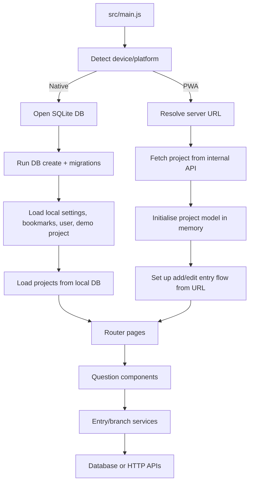
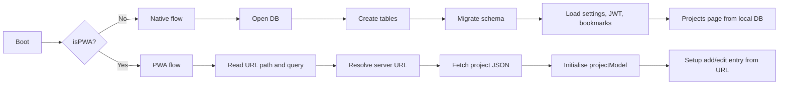
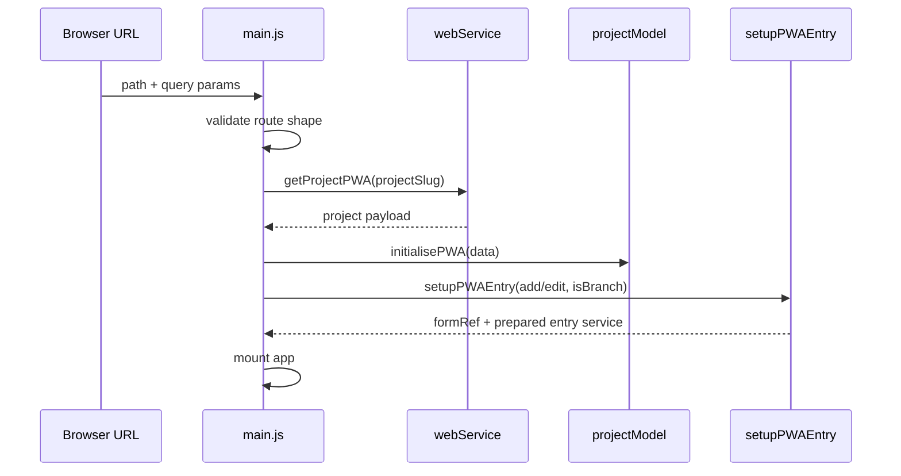
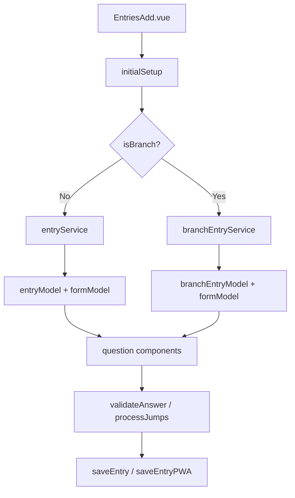
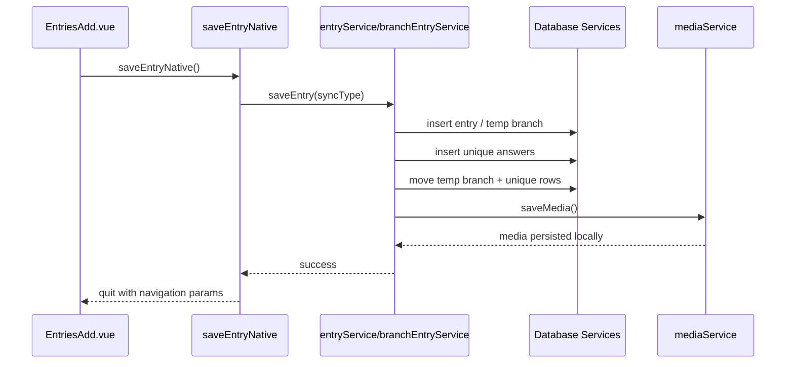
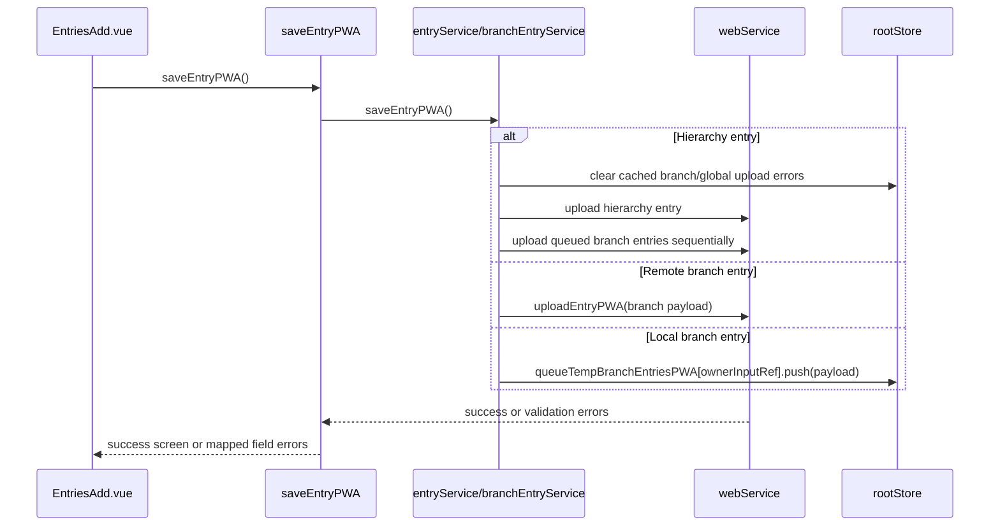

# App Architecture

This document describes the overall architecture of the Epicollect5 mobile app codebase and the main runtime flows across its two execution targets:

- **Native mobile app**: Ionic + Vue + Capacitor, with local SQLite storage and offline-first workflows
- **PWA**: Ionic + Vue running in the browser, with server-backed project and entry flows

The architecture is intentionally split early at boot. After platform detection, the app follows two materially different paths for data loading, routing assumptions, persistence, and save/upload behavior.

## High-Level Architecture



## Main Layers

### 1. Application Shell

Core responsibilities:

- Bootstraps Vue, Ionic, and Pinia
- Detects whether execution is `PWA` or native
- Registers global components
- Initializes persistent state before `app.mount()`

Primary file:

- `src/main.js`

Key behavior:

- The app uses an async IIFE in `main.js` so boot logic completes before the app mounts.
- `rootStore.isPWA` is derived from `device.platform === PARAMETERS.PWA`.
- The boot path diverges immediately after platform detection.

### 2. Router Layer

Primary file:

- `src/router/index.js`

Behavior:

- Routes are built differently depending on `VUE_APP_MODE`.
- **PWA routes** are narrow and URL-driven.
- **Native routes** expose the full multi-page app shell.
- Native mode includes a router guard that redirects reloads back to the projects page, because direct reload of nested screens is not treated as a supported navigation entry point.

### 3. State Layer

Pinia is the singleton state backbone.

Stores:

- `src/stores/root-store.js`: global runtime state, modal state, route params, progress, user, platform flags
- `src/stores/db-store.js`: database handle, DB version, entry ordering preferences
- `src/stores/bookmark-store.js`: bookmarks cache and sorting

Practical role of each:

- `rootStore` acts as both app state and a message bus between pages, services, and modal flows.
- `dbStore` owns the live SQLite handle in native mode.
- `bookmarkStore` caches bookmark rows for quick UI access.

### 4. Model Layer

Models are mutable singleton domain objects, not classes.

Primary models:

- `src/models/project-model.js`
- `src/models/form-model.js`
- `src/models/entry-model.js`
- `src/models/branch-entry-model.js`

Responsibilities:

- Hold the currently active project structure in memory
- Expose form/input traversal helpers
- Hold the currently edited entry or branch entry shape

Important distinction:

- **Models are stateful domain containers**
- **Services are operational logic**

### 5. Service Layer

The service layer is organized by concern, mostly as exported object literals.

Major groups:

- `src/services/database/`: SQLite create/select/insert/update/delete/migrate, including `deleteRemoteEntries()` for cleaning up remote entries before re-download
- `src/services/entry/`: entry editing, answer handling, jumps, media handling, save behavior
- `src/services/filesystem/`: media directories, temp/persistent storage, file writes/moves/deletes
- `src/services/auth/`: login providers and auth workflows
- `src/services/utilities/`: versioning, downloads, JSON transforms, bookmarks, location, Rollbar, misc helpers
- `src/services/web-service.js`: HTTP boundary for project fetch, uploads, downloads, PWA endpoints

## Runtime Split: Native vs PWA



## Native App Architecture

### Boot Flow

The native flow is offline-first and database-centric.

Sequence:

1. `initService.getDeviceInfo()` detects platform
2. `initService.getAppInfo()` and language settings are loaded
3. `initService.openDB()` opens SQLite
4. `createDatabaseService.execute()` creates base tables
5. `initService.getDBVersion()` reads `settings.db_version`
6. `initService.migrateDB()` applies `ALTER TABLE` migrations
7. Media directories are created on device
8. Server URL, bookmarks, entry ordering, text size, error collection preference, and JWT are loaded
9. Demo project insertion and temp-table cleanup run
10. App mounts and routes into the projects flow

```mermaid
sequenceDiagram
    participant Main as main.js
    participant Init as initService
    participant DB as SQLite
    participant Create as createDatabaseService
    participant Migrate as databaseMigrateService
    participant Stores as Pinia Stores

    Main->>Init: getDeviceInfo()
    Main->>Init: getAppInfo(), getLanguage()
    Main->>Init: openDB(platform)
    Init-->>Main: db handle
    Main->>Create: execute(db)
    Create->>DB: CREATE TABLE IF NOT EXISTS ...
    Main->>Init: getDBVersion()
    Main->>Init: migrateDB()
    Init->>Migrate: execute(dbVersion)
    Migrate->>DB: ALTER TABLE ...
    Main->>Stores: set db, dbVersion, bookmarks, user, prefs
    Main->>Main: mount app
```

### Data Model in Native Mode

Primary persistence model:

- Project definitions are stored locally in SQLite
- Entries, branch entries, media metadata, unique answers, settings, bookmarks, and users are also local
- Question answers are saved locally first, then uploaded later

Operational consequences:

- The app remains usable without network connectivity
- Upload and download are explicit user flows
- Entry sync state is tracked per row

### Native Navigation Model

Typical user path:

1. `Projects.vue` lists local projects
2. Selecting a project writes `rootStore.routeParams`
3. `Entries.vue` loads the project and entry list for a form
4. `EntriesAdd.vue` runs question-by-question editing
5. `EntriesUpload.vue` or `EntriesDownload.vue` handles server sync

`rootStore.routeParams` is the key cross-page handoff mechanism.

## PWA Architecture

### Boot Flow

The PWA path is server-driven and URL-driven.

Sequence:

1. Read `window.location.pathname` and query params
2. Validate the path segment (`add-entry` or `edit-entry`)
3. Resolve `rootStore.serverUrl`
4. Load language resources for PWA
5. Fetch project definition from internal API via `webService.getProjectPWA()`
6. Initialise `projectModel` with server data
7. Determine whether the user is adding/editing a hierarchy entry or branch entry
8. Use `setupPWAEntry()` to prepare `entryService` or `branchEntryService`
9. Seed `rootStore.routeParams` for the question flow



### Data Model in PWA Mode

Persistence is intentionally lighter:

- The current project structure lives in memory
- Entry editing is orchestrated in memory
- Existing entries are fetched from the server when editing
- New hierarchy entries are uploaded directly
- New local branch entries can be temporarily queued in `rootStore.queueTempBranchEntriesPWA`

Branch editing has two modes:

- `PWA_BRANCH_LOCAL`: branch entries are attached to a hierarchy entry being edited in the same session
- `PWA_BRANCH_REMOTE`: a branch entry is being edited directly through a URL-backed server flow

### PWA Routing Model

The URL is the source of truth.

Supported route shapes:

- `/project/:project_slug/add-entry`
- `/project/:project_slug/edit-entry`
- `/project/:project_slug/add-entry/branch`

Query params carry operational context such as:

- `uuid`
- `form_ref`
- `parent_form_ref`
- `parent_uuid`
- `branch_ref`
- `branch_owner_uuid`

## Project Structure Lifecycle

Project structure is normalized into the in-memory `projectModel`, which the rest of the app treats as the canonical schema for form traversal.

Sources:

- Native: local DB row with `json_extra` and `mapping`
- PWA: server payload from `webService.getProjectPWA()`

Supporting services:

- `src/services/project-extra-service.js` generates the `project_extra` structure
- `src/services/project-mapping-service.js` generates or validates the project mapping

`projectModel` responsibilities:

- Form order traversal
- Input lookup by ref or index
- Group and branch structure lookup
- Project metadata lookup
- Media-question discovery

## Entry Editing Architecture

The entry editor is a question-driven workflow centered on:

- `src/pages/EntriesAdd.vue`
- `src/use/questions/initial-setup.js`
- `src/use/questions/handle-next.js`
- `src/use/questions/handle-prev.js`
- `src/services/entry/entry-service.js`
- `src/services/entry/branch-entry-service.js`

### Core Pattern

`EntriesAdd.vue` does not embed the business rules for entry persistence. Instead it:

- reads current route params from `rootStore`
- delegates to `initialSetup()`
- renders the correct question component for the current input type
- delegates validation and navigation to the entry services and question helpers

### Entry Services

There are two parallel services:

- `entryService`: hierarchy entries
- `branchEntryService`: branch entries

They share a common editing shape:

- current form
- current entry object
- answer retrieval
- answer validation
- jump processing
- save behavior



### Question Rendering

`EntriesAdd.vue` renders one question component at a time based on `state.questionParams.type`.

Examples:

- `QuestionText`
- `QuestionInteger`
- `QuestionLocation`
- `QuestionGroup`
- `QuestionBranch`
- `QuestionPhoto`
- `QuestionAudio`
- `QuestionVideo`

The page acts as an orchestration shell. Individual input semantics live in the question components and validation services.

### Jumps, Groups, and Branches

- **Groups** are nested question sets rendered within a parent input type
- **Branches** create child-entry workflows tied to an owner input and owner entry
- **Jumps** alter navigation by skipping or revealing downstream questions

The entry services call shared helpers in `entry-common-service` to:

- validate answers
- process next/previous jumps
- derive save state
- build entry titles

## Save Flows

### Native Save Flow

Native saves are local-first.

Sequence:

1. Validate current answer(s)
2. Build/update the entry title
3. Unsync parent entries if needed
4. Insert/update the main entry in SQLite
5. Insert unique answers
6. Move temp branch rows into main branch tables
7. Move temp unique answers
8. Save media metadata and files locally
9. Navigate back to the appropriate entries screen



### PWA Save Flow

PWA saves are server-oriented.

Hierarchy entry behavior:

- Main entry is prepared in memory
- Related local branch entries can be uploaded sequentially
- Server validation errors are mapped back to input refs and surfaced in the UI

Branch behavior:

- Remote branch edit: upload directly to the server
- Local branch within a hierarchy edit: queue in memory until the hierarchy entry uploads



## Upload and Download Flows

### Native Upload

Native sync is a staged process:

1. Upload entries via `uploadDataService`
2. Upload media files via `uploadMediaService`

`uploadDataService` walks the hierarchy in a depth-first style:

- upload top-level parent
- upload its branches
- upload child entries
- continue until the subtree is complete
- mark rows synced as the traversal unwinds

This ordering is important because branch and child rows depend on parent UUID relationships.

### Native Download

`entriesDownloadService` orchestrates the download flow:

1. **Version check**: before downloading, the service compares local `projectModel` version with the remote `structure_last_updated`. If out of date, the user is prompted to update the project first. This prevents downloaded entries from being rendered against a stale project model (which caused group questions added after entry collection to be skipped silently).
2. **Cache clearing**: after a project update, the download cache (page URLs, progress, resume state) is cleared so stale data is not reused.
3. **Duplicate prevention**: existing remote entries for the target form are deleted via `databaseDeleteService.deleteRemoteEntries()` before downloading, avoiding duplicate rows.
4. `downloadService.downloadFormEntries(formRef)` fetches paginated entry data from the server, flattens JSON entries into local DB row shape, inserts them as synced remote entries, and updates progress through `notificationService`.

This version-check-then-download pattern is the key safeguard against stale project models in the native download flow.

## Versioning and Project Updates

Project structure versioning is handled by `versioningService`.

Responsibilities:

- compare local `projectModel.getLastUpdated()` with remote `structure_last_updated`
- download updated project metadata when needed
- write new project structure and mapping to SQLite
- migrate existing entries against the new form structure
- delete entries for forms removed from the project
- refresh the project logo

This is one of the more coupled flows in the app because it touches:

- web APIs
- project model state
- DB project metadata
- stored entries
- media/logo assets

## Filesystem and Media Architecture

Media handling exists only in a meaningful way on native devices, with limited PWA variants.

Main responsibilities:

- create legacy-compatible media directories
- maintain temp and persistent directories
- save media metadata in SQLite
- move, write, and delete device files
- upload stored media after data sync

Relevant services:

- `media-dirs-service`
- `temp-dirs-service`
- `persistent-dirs-service`
- `write-file-service`
- `move-file-service`
- `delete-file-service`
- `src/services/entry/media-service.js`
- `upload-media-service.js`

Important compatibility detail:

- The native app intentionally preserves legacy directory behavior to avoid breaking upgrades from older storage layouts.

## Authentication Model

The app supports two auth styles depending on execution mode:

- **Native**: JWT-based API access, token stored locally and injected by `webService.getHeaders()`
- **PWA**: browser session/cookie flow against internal endpoints

Auth workflows are coordinated with:

- `rootStore.user`
- `rootStore.afterUserIsLoggedIn`
- modal-driven login flows from `src/services/modals/` and `src/services/auth/`

A common recovery pattern is:

1. operation fails with auth error
2. store callback in `afterUserIsLoggedIn`
3. logout/reset token
4. show login modal
5. retry deferred action after successful login

## Error Handling and User Feedback

Error reporting is layered:

- UI alerts and progress dialogs via `notificationService`
- field-level validation errors via `errorsService`
- server validation errors mapped back to input refs
- Rollbar initialization after router readiness

Operational patterns:

- native DB and filesystem errors typically surface as alerts
- web validation errors are translated into question-level errors
- PWA branch upload errors may be cached in `rootStore.queueBranchUploadErrorsPWA`
- global PWA upload errors are cached in `rootStore.queueGlobalUploadErrorsPWA`

## Architectural Strengths

- Clear early separation between native and PWA runtime paths
- Strong offline-first model for native data collection
- Centralized domain state through Pinia stores and singleton models
- Reusable question/editor shell across hierarchy and branch flows
- Service-based decomposition around persistence, transport, validation, and filesystem concerns

## Architectural Constraints and Tradeoffs

- The app relies heavily on mutable singleton objects (`projectModel`, `entryService`, `branchEntryService`, Pinia stores), which makes flow orchestration simple but increases coupling.
- `main.js` owns a large amount of boot responsibility, so startup behavior is centralized but dense.
- Navigation context often travels through `rootStore.routeParams` rather than typed route params alone, which is flexible but implicit.
- Native and PWA share UI surfaces but have materially different persistence semantics, so behavior can diverge behind similar screens.
- Some schema/versioning constants and migration logic are not fully aligned, which increases maintenance risk.

## Mental Model for Working in This Codebase

When tracing a feature, the fastest route is usually:

1. Determine whether the feature is **native-only**, **PWA-only**, or **shared**
2. Check whether the flow starts in `main.js`, a page component, or a `use/` helper
3. Identify the active model and service pair
4. Follow persistence through either:
   - database services and filesystem services
   - `webService` and PWA upload/download helpers
5. Check `rootStore` for cross-page or modal state

If you keep the following split in mind, most of the code becomes easier to navigate:

- **Project structure and active entry state live in singleton models/stores**
- **Operational behavior lives in services**
- **Pages orchestrate flows**
- **Question components render one input at a time**
